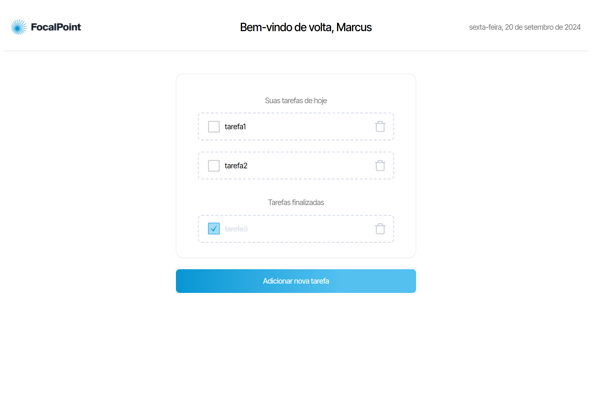

# Projeto Lista de Tarefas

Este projeto foi desenvolvido como parte do desafio da LegaPlan, seguindo as instruções disponíveis no [Figma](https://www.figma.com/design/4iESWnasLZSHyghg1ipj1P/Teste-Dev-Junior---Legaplan).

## Descrição

O aplicativo de lista de tarefas permite que os usuários gerenciem suas tarefas diárias de forma simples e eficiente. Com uma interface intuitiva, você pode adicionar, editar e remover tarefas, além de marcar as concluídas.



## Tecnologias Utilizadas

- **TypeScript**
- **Node.js**
- **npm**
- **NextJs**
- **Sass**

## Como Executar o Projeto

Siga os passos abaixo para configurar e executar o projeto localmente:

1. Clone o repositório
2. Navegue até o diretório do projeto
3. Instale as dependências:
    ```bash
    npm install
4. Inicie o servidor de desenvolvimento:
    ```bash
    npm run dev
